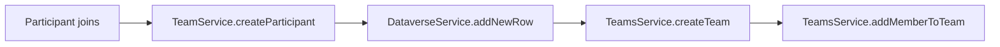
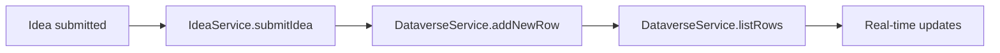
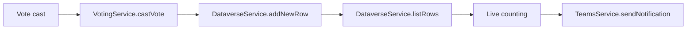
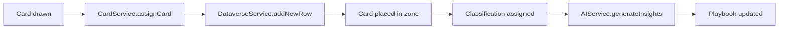
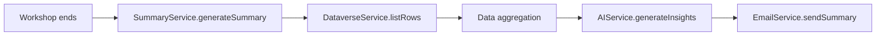
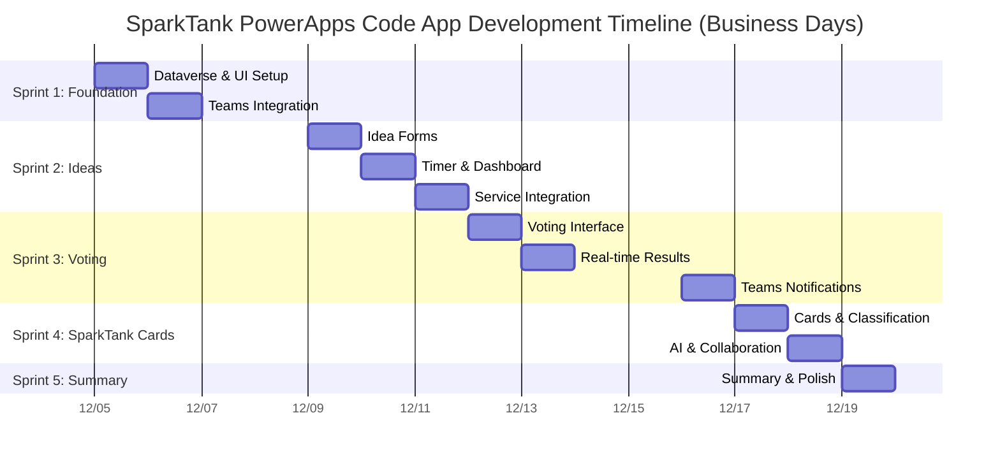
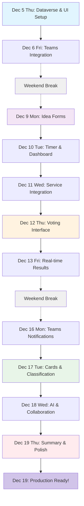

# SparkTank PowerApps Code App - Implementation Plan

## What We're Building
A digital workshop platform that replaces paper-based AI ideation sessions with an interactive PowerApps experience. Teams join, submit ideas, vote, and get comprehensive summaries - all in real-time.

## Implementation Approach

### Development Foundation
- **Modern Tech Stack**: React + TypeScript for robust, type-safe development
- **Fluent UI Components**: Microsoft's design system for consistent user experience
- **PowerApps Code SDK**: Streamlined Dataverse integration and deployment
- **Power Platform Connectors**: Pre-built integrations for Teams and data management
- **Existing Foundation**: Building on established architecture patterns

### Development Stack Benefits
- **React + TypeScript**: Rapid prototyping with type safety
- **Vite Hot Reload**: Instant feedback during development
- **Component Libraries**: Reusable UI patterns
- **Power Platform Integration**: Built-in enterprise features

## Implementation Timeline

### Sprint 1: Foundation & Team Management (3 days)
**Goal**: Complete team formation with Microsoft Teams integration

**What to Build**:
- Enhanced team formation interface
- Microsoft Teams connector integration
- Real-time participant management
- Dataverse schema implementation

**Power Platform Connectors Used**:
- **Create Team**: Integrated via TeamsService class using REST API
- **Add Member to Team**: Direct connector call in TeamsService.addMemberToTeam()
- **Add New Row**: DataverseService.create() method for storing team and participant data
- **List Rows**: DataverseService.list() method for real-time team status updates

**Day-by-Day Breakdown**:
- **Day 1**: Dataverse schema design and basic UI setup
  - Create Sessions, Teams, Participants tables
  - Set up relationships and security
  - Begin UI development for team formation
- **Day 2**: Teams connector integration and enhanced UI
  - Implement TeamsService.createTeam() method
  - Implement TeamsService.addMemberToTeam() method
  - Complete professional team formation interface
- **Day 3**: Testing, refinement, and real-time updates
  - End-to-end team formation testing
  - Real-time updates via polling mechanism
  - Mobile responsiveness validation

**Success Criteria**:
- Teams auto-created in Microsoft Teams
- Participants automatically added to channels
- Real-time dashboard showing team formation progress
- All data persisted to Dataverse

**Key Deliverables**:
- Professional team formation interface (Facilitator + Participant views)
- Teams connector integration for automatic channel creation
- Dataverse schema with Teams, Participants, Sessions tables
- Real-time updates via Power Automate flows

### Sprint 2: Idea Collection & Management (2-3 days)
**Goal**: Digital idea submission with enhanced tracking

**What to Build**:
- Two-path idea submission forms with AI assistance
- Real-time idea tracking dashboard
- Enhanced timer with Power Automate triggers
- Idea categorization and validation

**Power Platform Connectors Used**:
- **Add New Row**: IdeaService.submitIdea() method to store submitted ideas with rich metadata
- **List Rows**: IdeaService.getIdeas() method for real-time idea feed for facilitator dashboard
- **Timer Management**: Built into TimerService class with React state management

**Day-by-Day Breakdown**:
- **Day 1**: Idea submission forms development
  - Build "Build Something Better" form
  - Build "Build Better Things" form
  - Implement form validation and error handling
- **Day 2**: Timer and dashboard development
  - 20-minute countdown with pause/reset using React state
  - Real-time facilitator dashboard via DataverseService.listRows()
  - Idea categorization and filtering
- **Day 3**: Service integration and testing
  - Complete IdeaService implementation
  - Real-time updates via polling mechanism
  - End-to-end testing and refinement

**Success Criteria**:
- 20-minute timer with automated notifications
- Ideas submitted and visible in real-time
- Form validation with AI-suggested improvements
- Facilitator can monitor progress across all teams

**Key Deliverables**:
- Enhanced idea submission forms with category selection
- Real-time facilitator dashboard with idea tracking
- Power Automate flows for timer management
- Ideas stored in Dataverse with full metadata

### Sprint 3: Voting & Results Engine (2-3 days)
**Goal**: Digital voting with real-time results and Teams notifications

**What to Build**:
- One-click voting interface
- Live vote counting with animations
- Winner identification algorithm
- Results notifications via Teams

**Power Platform Connectors Used**:
- **Add New Row**: VotingService.castVote() to record votes with participant and idea relationships
- **List Rows**: VotingService.getVoteResults() for real-time vote counting and leaderboard updates
- **Teams Notifications**: TeamsService.sendMessage() to send congratulations and results to team channels

**Day-by-Day Breakdown**:
- **Day 1**: Voting interface development
  - Professional voting cards interface
  - One-click voting mechanism
  - Vote confirmation and feedback
- **Day 2**: Real-time counting and results
  - Live vote tracking dashboard
  - Winner identification algorithm
  - Results reveal controls for facilitator
- **Day 3**: Teams integration via services
  - TeamsService.sendMessage() for congratulations
  - Winner announcements via direct connector calls
  - Results sharing functionality

**Success Criteria**:
- Voting works smoothly across all devices
- Live vote updates visible to facilitator
- Winners automatically identified and celebrated
- Results shared in Teams channels

**Key Deliverables**:
- Professional voting interface with immediate feedback
- Real-time vote counting with visual updates
- Automated winner identification and notification
- Teams integration for results sharing

### Sprint 4: SparkTank Card Activity Engine (3 days)
**Goal**: Digital implementation of structured card-based use case analysis

**What to Build**:
- Digital card deck system with 5 categories
- Interactive canvas with drag-and-drop functionality
- AI-powered playbook generation
- Real-time team collaboration features

**Power Platform Connectors Used**:
- **Add New Row**: CardService.assignCardToTeam() to record card draws and classifications
- **List Rows**: CardService.getTeamCards() for real-time card status across teams
- **AI Builder**: AIService.generatePlaybookContent() for contextual insights based on card selections
- **Teams Integration**: TeamsService.sharePlaybook() for distributing completed analysis

**Day-by-Day Breakdown**:
- **Day 1**: Card deck, canvas system, and classification
  - Digital card deck with 40+ cards across 5 categories
  - 5-zone interactive canvas (Stakeholders, Objectives, Challenges, Outcomes, Wildcard)
  - Category-specific classification controls (Critical/Influential/Primary/etc.)
- **Day 2**: AI playbook generation and team collaboration
  - AIService.generateStakeholderInsights() for explaining critical stakeholder selections
  - AIService.generateObjectiveRationale() for objective prioritization
  - AIService.generateMitigationStrategies() for challenge management
  - Real-time team collaboration features within canvas
- **Day 3**: Integration, export, and facilitator dashboard
  - Completed playbook export functionality
  - Teams integration for sharing analysis
  - Facilitator monitoring dashboard for all team progress
  - End-to-end testing and refinement

**Success Criteria**:
- Teams can draw and classify cards intuitively
- AI generates meaningful, contextual insights
- Collaborative canvas works smoothly in real-time
- Completed playbooks capture comprehensive use case framework
- Facilitator has visibility into all team progress

**Key Deliverables**:
- Interactive 5-zone card canvas with real-time collaboration
- Digital card deck with category-based classification system
- AI-powered playbook generation for all analysis sections
- Export and sharing capabilities for completed frameworks

### Sprint 5: AI-Enhanced Summary & Insights (2-3 days)
**Goal**: Comprehensive workshop summary with AI insights

**What to Build**:
- Winner package generator with professional formatting
- AI-powered summary for non-winning ideas
- Export and email distribution system
- Workshop analytics dashboard

**Power Platform Connectors Used**:
- **List Rows**: SummaryService.getWorkshopData() to aggregate workshop data for analysis
- **Email Distribution**: EmailService.sendSummary() for direct email distribution
- **AI Insights**: AIService.generateSummary() for generating insights and summaries for ideas
- **Document Storage**: SharePointService.storeDocument() to store and share workshop documents

**Day-by-Day Breakdown**:
- **Day 1**: Summary generation system
  - Winner package template creation
  - Data aggregation from all tables
  - Professional document formatting
- **Day 2**: AI integration and email system via services
  - AIService.generateSummary() integration
  - EmailService.sendSummary() for direct email distribution
  - SharePointService.storeDocument() for document storage
- **Day 3**: Analytics and final testing
  - Workshop analytics dashboard
  - End-to-end testing
  - Performance optimization

**Success Criteria**:
- Professional winner packages generated automatically
- AI summaries provide valuable insights
- Email distribution works reliably
- Analytics provide organizational learning value

**Key Deliverables**:
- Automated winner package generation
- AI-powered idea summaries and insights
- Email distribution system
- Workshop analytics and reporting

## Technical Architecture with Connectors

### Data Flow Integration



**Team Formation Flow**



**Idea Submission Flow**



**Voting Process Flow**



**SparkTank Card Activity Flow**



**Summary Generation Flow**

### Dataverse Schema Design

**Sessions Table:**
- SessionId (Primary Key)
- Name, StartTime, CurrentStage, Status
- FacilitatorEmail, ParticipantCount
- TeamsChannelId (for main workshop channel)

**Teams Table:**
- TeamId (Primary Key)
- SessionId (Foreign Key)
- Name, Color, MaxMembers, TeamsChannelId
- IsReady, CreatedDate

**Participants Table:**
- ParticipantId (Primary Key)
- Name, Email, Role (Facilitator/Participant)
- TeamId (Foreign Key), JoinedAt
- TeamsUserId (for Teams integration)

**Ideas Table:**
- IdeaId (Primary Key)
- Title, Description, Category, SubmittedBy
- TeamId (Foreign Key), SubmittedAt, VoteCount
- AIAssistance, ExpectedImpact

**SparkTank Cards Table:**
- CardId (Primary Key)
- CardName, CardCategory (Stakeholders/Objectives/Challenges/Outcomes/Wildcard)
- CardDescription, CardType, IsActive, SortOrder

**Team Card Assignments Table:**
- AssignmentId (Primary Key)
- SessionId, TeamId, CardId (Foreign Keys)
- Classification, Impact, AssignedAt, IsAnalyzed

**Playbooks Table:**
- PlaybookId (Primary Key)
- SessionId, TeamId (Foreign Keys)
- SectionType, AIGeneratedContent, UserModifications
- IsAIGenerated, IsCompleted, GeneratedAt

**Votes Table:**
- VoteId (Primary Key)
- ParticipantId (Foreign Key)
- IdeaId (Foreign Key)
- VotedAt

**Summaries Table:**
- SummaryId (Primary Key)
- SessionId (Foreign Key)
- WinnerData, AISummary
- GeneratedAt, EmailSent

### Real-Time Features with Code Apps Services

**1. Team Formation Logic (TeamService.ts):****
   - New participant joins → updateTeamStatus()
   - Team becomes full → notifyFacilitator()
   - All teams ready → enableWorkshopStart()
   - Real-time updates via periodic refresh

**2. Idea Submission Logic (IdeaService.ts):**
   - Timer starts → startTimer() with React useEffect
   - Idea submitted → submitIdea() → updateFacilitatorDashboard()
   - Time expires → autoAdvanceToVoting()

**3. Voting Logic (VotingService.ts):**
   - Vote cast → castVote() → updateLiveLeaderboard()
   - Voting complete → identifyWinners()
   - Results ready → sendTeamsNotifications()

**4. Summary Logic (SummaryService.ts):**
   - Workshop ends → generateAISummaries()
   - Summaries ready → emailParticipants()
   - Documents created → storeInSharePoint()

### Power Platform Connector Implementation Details

**Microsoft Teams Connectors:**

**Create Team:**
- Action: "Create a team"
- Team Name: {Dynamic from SparkTank team name}
- Team Type: "Standard"
- Privacy: "Private"
- Description: "SparkTank Workshop Team - {SessionName}"
- **Documentation**: [Create a Team Connector](https://learn.microsoft.com/en-us/connectors/teams/?tabs=text1%2Cdotnet#create-a-team)

**Add Member to Team:**
- Action: "Add a member to a team"
- Team ID: {From Create Team response}
- User ID: {From participant email/AAD lookup}
- Role: "Member"
- **Documentation**: [Add Member to Team Connector](https://learn.microsoft.com/en-us/connectors/teams/?tabs=text1%2Cdotnet#add-a-member-to-a-team)

**Dataverse Connectors:**

**Add New Row:**
- Environment: {Your Power Platform Environment}
- Table: {Sessions/Teams/Participants/Ideas/Votes}
- Data: {Dynamic content from forms/actions}
- **Documentation**: [Add a New Row Connector](https://learn.microsoft.com/en-us/connectors/commondataserviceforapps/#add-a-new-row)

**List Rows:**
- Environment: {Your Power Platform Environment}
- Table: {Relevant table}
- Filter: {Session-specific or team-specific filters}
- Order By: {Relevant sorting}
- **Documentation**: [List Rows Connector](https://learn.microsoft.com/en-us/connectors/commondataserviceforapps/#list-rows)

**Code Apps Service Implementation Examples**:
```typescript
// TeamService.ts
class TeamService {
  async createTeam(teamData: TeamData): Promise<Team> {
    // Create team in Dataverse
    const team = await dataverseService.addNewRow('teams', teamData);
    
    // Create Teams channel
    const channel = await teamsConnector.createTeam({
      name: teamData.name,
      type: 'Standard',
      privacy: 'Private'
    });
    
    // Update team with channel ID
    await dataverseService.updateRow('teams', team.id, { 
      teamsChannelId: channel.id 
    });
    
    return team;
  }
  
  async addMemberToTeam(participantId: string, teamId: string): Promise<void> {
    const participant = await dataverseService.getRow('participants', participantId);
    const team = await dataverseService.getRow('teams', teamId);
    
    // Add to Teams channel
    await teamsConnector.addMemberToTeam(team.teamsChannelId, participant.email);
    
    // Update participant record
    await dataverseService.updateRow('participants', participantId, { teamId });
  }
}

// VotingService.ts
class VotingService {
  async castVote(participantId: string, ideaId: string): Promise<VoteResult> {
    // Record vote in Dataverse
    const vote = await dataverseService.addNewRow('votes', {
      participantId,
      ideaId,
      votedAt: new Date()
    });
    
    // Update live vote count
    const voteCount = await this.getVoteCount(ideaId);
    await dataverseService.updateRow('ideas', ideaId, { voteCount });
    
    // Check if voting is complete and identify winners
    if (await this.isVotingComplete()) {
      await this.identifyWinners();
    }
    
    return { vote, currentCount: voteCount };
  }
}

// SummaryService.ts
class SummaryService {
  async generateWorkshopSummary(sessionId: string): Promise<Summary> {
    // Aggregate all workshop data
    const ideas = await dataverseService.listRows('ideas', { sessionId });
    const votes = await dataverseService.listRows('votes', { sessionId });
    const teams = await dataverseService.listRows('teams', { sessionId });
    
    // Generate AI insights
    const aiSummary = await aiService.generateInsights(ideas);
    
    // Create summary document
    const summary = await dataverseService.addNewRow('summaries', {
      sessionId,
      winnerData: this.getWinnerData(ideas, votes),
      aiSummary,
      generatedAt: new Date()
    });
    
    // Email participants
    await emailService.sendSummary(summary);
    
    return summary;
  }
}

// CardService.ts
class CardService {
  async drawCard(teamId: string, sessionId: string): Promise<Card> {
    // Get available cards for team
    const availableCards = await this.getAvailableCards(teamId);
    const randomCard = availableCards[Math.floor(Math.random() * availableCards.length)];
    
    // Assign card to team
    await dataverseService.addNewRow('teamcardassignments', {
      sessionId,
      teamId,
      cardId: randomCard.id,
      assignedAt: new Date(),
      isAnalyzed: false
    });
    
    return randomCard;
  }
  
  async classifyCard(assignmentId: string, classification: string, impact?: string): Promise<void> {
    await dataverseService.updateRow('teamcardassignments', assignmentId, {
      classification,
      impact,
      isAnalyzed: true
    });
  }
  
  async generatePlaybookSection(teamId: string, sectionType: string): Promise<PlaybookSection> {
    // Get team's card assignments for this section
    const cards = await dataverseService.listRows('teamcardassignments', {
      teamId,
      'card/category': sectionType
    });
    
    // Generate AI insights based on card selections
    const aiContent = await aiService.generateSectionInsights(cards, sectionType);
    
    // Store playbook section
    const playbook = await dataverseService.addNewRow('playbooks', {
      teamId,
      sectionType,
      aiGeneratedContent: aiContent,
      isAIGenerated: true,
      isCompleted: true,
      generatedAt: new Date()
    });
    
    return playbook;
  }
}
```

## Development Acceleration Strategies

## Development Best Practices

**1. Component-Based Development:**
   - Build reusable Fluent UI components
   - Maintain consistent styling and behavior
   - Follow Microsoft design guidelines

**2. Form Development:**
   - Create structured form validation
   - Implement proper error handling
   - Ensure responsive design

**3. Service Integration:**
   - Create clean API abstractions
   - Implement proper error handling
   - Build efficient data access patterns

**4. Real-time Updates:**
   - Implement polling for live data updates
   - Manage state effectively
   - Ensure smooth user experience

### Fluent UI Rapid Development

**1. Design System Consistency:**
   - Use Fluent UI tokens for all styling
   - Leverage pre-built component patterns
   - Follow Microsoft accessibility guidelines

**2. Component Library:**
   - AvatarGroup for team member display
   - Cards for ideas and voting
   - ProgressBar for timer visualization
   - MessageBar for notifications

**3. Responsive Design:**
   - Built-in mobile responsiveness
   - Touch-friendly interactions
   - Accessible by default

## Timeline Summary - AI-Accelerated

### Total Duration: 11 business days (December 5-19, 2025)

**Sprint 1 (2 business days)**: Foundation & Teams Integration (Dec 5-6)
**Sprint 2 (3 business days)**: Idea Collection System (Dec 9-11)  
**Sprint 3 (3 business days)**: Voting & Results (Dec 12-13, 16)
**Sprint 4 (2 business days)**: SparkTank Card Activity (Dec 17-18)
**Sprint 5 (1 business day)**: AI Summary & Distribution (Dec 19)

### Timeline - Execution Overview



### Daily Sprint Breakdown



### Key Development Factors

**UI Development Efficiency**:
- Component-based architecture for rapid development
- Fluent UI integration for consistent experience
- Built-in accessibility and responsiveness

**Power Platform Integration**:
- Pre-built connectors with clear documentation
- Visual flow design capabilities
- Automatic Dataverse relationship handling

**Testing & Deployment**:
- Hot reload for immediate feedback
- Built-in Power Platform deployment tools
- Integrated debugging and error handling

## Risk Mitigation

### Technical Risks
- **Connector Rate Limits**: Implement proper retry logic and batch operations
- **Real-time Performance**: Use efficient polling intervals and data filtering
- **Mobile Compatibility**: Test on actual devices throughout development

### Business Risks
- **Stakeholder Feedback**: Daily demos to catch issues early
- **User Training**: Create documentation during development
- **Deployment Issues**: Use staging environment for validation

## Success Metrics

### Development Velocity
- **UI Components**: 3-4 complete screens per day with modern tooling
- **Connector Integration**: 1-2 connectors per day
- **End-to-End Features**: 1 complete user flow every 2-3 days

### Quality Assurance
- **Zero Critical Bugs**: Comprehensive testing at each sprint
- **Performance Targets**: <3 second load times, <500ms real-time updates
- **User Experience**: Intuitive interface requiring minimal training

## Conclusion

This implementation approach leverages modern development tools and Power Platform capabilities to deliver a production-ready SparkTank application in 2-2.5 weeks.

The key success factors are:
1. **Modern Development Stack**: React + TypeScript + Fluent UI for reliability
2. **Pre-built Connectors**: Leverage existing Teams and Dataverse integrations
3. **Component-Based Architecture**: Reusable patterns for consistent experience
4. **Incremental Delivery**: Working features every 2-3 days for validation

This timeline assumes experienced developers using modern tools effectively and stakeholders available for daily feedback and validation.